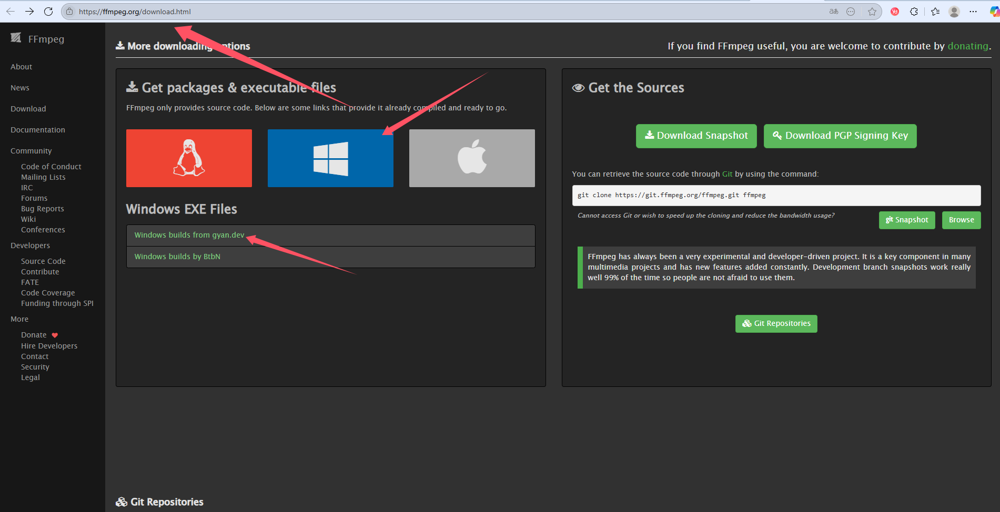
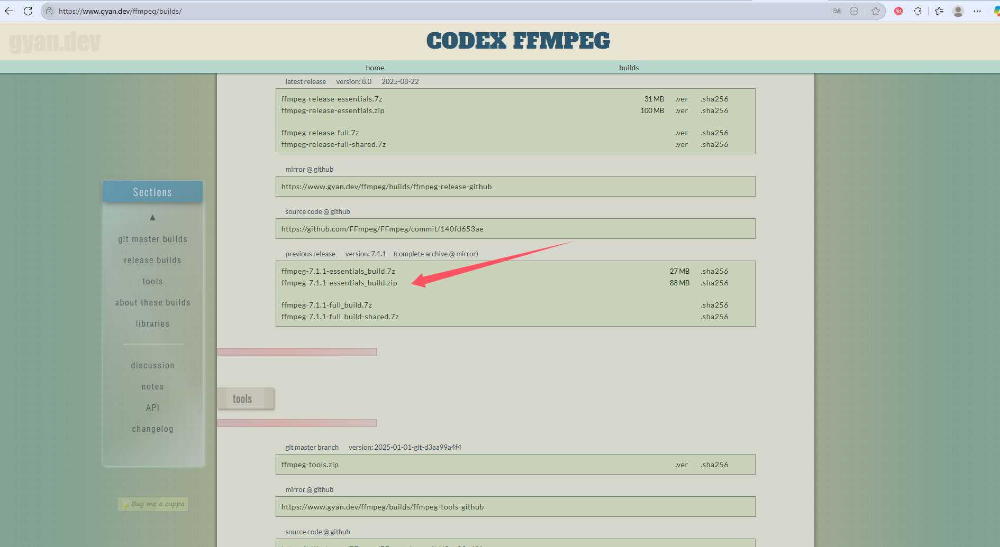

# B站视频字幕提取工具

基于浏览器自动化的B站视频字幕提取工具，支持AI小助手字幕获取和语音识别生成字幕。

## 主要功能

- 🤖 **AI字幕提取**：自动操作B站AI小助手获取字幕
- 🎙️ **语音识别**：使用Whisper模型从音频生成字幕
- 📝 **多格式输出**：支持SRT、TXT、JSON格式
- 🌐 **GUI界面**：简单易用的图形界面

## 依赖要求

- Python 3.7+
- Microsoft Edge 浏览器
- FFmpeg（可选，用于语音识别）
- https://ffmpeg.org/download.html
- 
- 
- 解压完成直接放入D盘，不要改名，程序已经将路径写死

### Python依赖包

```
requests>=2.25.0
urllib3>=1.26.0
openai-whisper>=20231117
yt-dlp>=2023.7.6
numpy<2.0
selenium>=4.0.0
```

## 安装和使用

### 1. 安装依赖
```bash
pip install -r requirements.txt
```

### 2. 启动程序
```bash
python subtitle_gui.py
```

### 3.打包成exe
```bash
pyinstaller --onefile --noconsole subtitle_gui.py
```

### 3. 使用步骤
1. 点击"启动Edge调试模式"
2. 在打开的Edge中登录B站账号
3. 输入B站视频链接
4. 选择AI模式或语音识别模式
5. 点击开始提取

## 注意事项

- AI字幕功能需要B站账号登录状态
- 较新的视频通常支持AI小助手功能
- 语音识别需要稳定的网络连接

## 常见问题

**Q: AI按钮找不到？**  
A: 确认视频支持AI功能且已登录B站账号

**Q: Edge启动失败？**  
A: 检查Edge是否安装，尝试以管理员身份运行

---

## 支持作者

如果这个工具对您有帮助，欢迎打赏支持！


---

❤️ 感谢您的支持！
